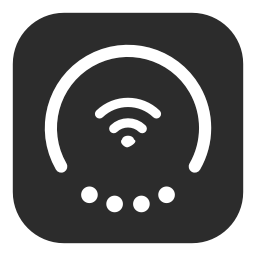

<p align="center"></p>

# MyDuoBar

把電池、Wi-Fi 和四項狀態放進一個圓形選單列圖示。原生 AppKit、完全在本機執行，沒有 Dock 圖示、帳號或第三方相依套件。

> 本專案是 [n977485865-create/DuoBar](https://github.com/n977485865-create/DuoBar)（commit `b278174`）的個人版本，介面支援繁體中文、英文與日文，並以 macOS 27 為主要目標。

## 與原版的差異

- **名稱**：App 名稱改為 MyDuoBar，Bundle ID 改為 `com.rex.myduobar`，不會與原版共用偏好設定或權限紀錄。
- **語言**：介面與系統權限說明支援繁體中文（台灣用語）、English、日本語，可在設定視窗切換。文件為繁體中文。
- **移除聯絡開發者區塊**：設定視窗不再顯示原作者的聯絡方式，App 內沒有任何外部網址。
- **Wi-Fi 子選單**：選單中的 Wi-Fi 會像系統 Wi-Fi 選單一樣往右展開，可開關 Wi-Fi、切換網路。
- **VPN 快選**：選單中的 VPN 會往側邊展開，列出系統中登錄的每個 VPN，各自有開關。
- **圖示說明**：設定視窗在圖示下方逐項說明外圈、顏色、中間圖形與底部圓點。
- **macOS 27**：以 macOS 27 SDK 編譯，最低支援 macOS 26.0。
- **Swift 6**：改用 Swift 6 語言模式與嚴格併發檢查，在 macOS 27 SDK 下零警告。
- **工具鏈**：建置腳本會自動挑選能讀取 macOS 27 SDK 的編譯器，避免 Xcode 與 Command Line Tools 版本不一致而編譯失敗。

## 資安檢查

2026-09-15 已逐一審查全部原始碼、建置腳本、CI 設定與資源檔，結論如下：

- App 本身不發出任何網路請求，不啟動命令列子程序，除偏好設定外不寫入檔案。
- 使用者按下狀態列或設定按鈕時，會透過系統開啟「系統設定」的對應頁面。
- Wi-Fi 子選單只在使用者操作時改變系統狀態：切換 Wi-Fi 開關，或加入使用者點選的網路。
- 加入有密碼的已知網路時，App 會透過 CoreWLAN 向鑰匙圈要該網路的密碼，macOS 會先詢問使用者是否授權。密碼只交給系統用來連線，不會顯示、儲存或傳出。
- 開放網路直接加入；未儲存密碼的加密網路一律交給「系統設定」處理，App 不會要求輸入密碼。
- VPN 子選單只在使用者按下開關時，透過 SystemConfiguration（與 `scutil --nc` 相同的公開 API）要求 macOS 連線或中斷該 VPN。App 不讀取 VPN 的帳號、金鑰或設定內容。
- 只用 UserDefaults 儲存圓點排列等本機偏好。
- 沒有第三方相依套件，執行檔只連結系統框架。
- 執行檔內沒有任何外部網址，也不會寫入剪貼簿。
- 圖示檔與文件內沒有夾帶腳本或隱藏字元，git 歷史中也沒有被刪除的可疑檔案。

## 系統需求

- macOS 26.0 或更新版本，主要在 macOS 27 上開發與驗證。
- 安裝包同時包含 Apple Silicon 與 Intel 架構。

## 安裝

建置後把 `build/MyDuoBar.app` 拖進「應用程式」資料夾，再從「應用程式」開啟。也可以使用 `dist/` 裡的 DMG 或 ZIP。

本機建置的 App 使用臨時簽章，沒有 Developer ID 簽名，也沒有經過 Apple 公證。在自己電腦上建置的版本可以直接開啟。若是從其他電腦複製過來而被 macOS 阻擋，請先嘗試開啟一次，再到「系統設定 → 隱私權與安全性」按「強制打開」。

## 語言

設定視窗最上方的「語言」選單可選擇：

| 選項 | 說明 |
| --- | --- |
| 跟隨系統 | 依 macOS 的語言順序，日文系統顯示日文，中文系統顯示繁體中文，其他顯示英文 |
| 繁體中文 | 固定使用繁體中文（台灣用語） |
| English | 固定使用英文 |
| 日本語 | 固定使用日文 |

切換後，設定視窗、選單與狀態面板會立即改用新語言。定位與專注模式的系統權限提示由 macOS 顯示，重新開啟 App 後才會套用新語言。

## Wi-Fi 子選單

把滑鼠移到選單中的 Wi-Fi 項目，會在右側展開，結構與系統 Wi-Fi 選單相同：

- **Wi-Fi 開關**：直接開啟或關閉 Wi-Fi。系統拒絕時會改開「Wi-Fi 設定」。
- **已知的網路**：附近範圍內已儲存的網路，目前連線的網路排第一並以藍色標示，有密碼的網路顯示鎖頭。
- **其他網路**：附近未儲存的網路，依訊號強度排序。
- **Wi-Fi 設定…**：開啟系統的 Wi-Fi 設定頁。

按一下網路即可加入。開放網路直接連線；有密碼且已儲存的網路會使用鑰匙圈中的密碼，macOS 可能先詢問授權；其他情況會開啟「Wi-Fi 設定」。

打開選單時會在背景掃描附近網路，結果保留 15 秒，所以展開子選單時通常已經有清單。系統未提供網路名稱時，子選單會顯示「允許顯示網路名稱…」以要求定位權限。

限制：iPhone 個人熱點的自動清單使用 Apple 私有功能，第三方 App 無法取得；只有熱點正在廣播時，才會以一般網路出現在清單中。

## VPN 快選

把滑鼠移到選單中的 VPN 項目，會在側邊展開：

- **每個 VPN 一列**：列出在「系統設定 → VPN」中登錄的 VPN，包含 Tailscale、Surfshark 這類由 App 提供的 VPN。每列顯示名稱、連線狀態與開關，按整列即可切換。
- **切換時選單保持開啟**：狀態會依序顯示「連線中…」「已連線」或「正在中斷…」。最長追蹤 30 秒，連不上時開關會回到關閉。
- **無法切換的 VPN**：以命令列啟動的 OpenVPN、Mihomo 的 TUN 路由與系統代理不在系統的 VPN 清單中，只會以灰字提示，請到各自的 App 切換。
- **VPN 設定…**：開啟系統的 VPN 設定頁。macOS 直接拒絕連線要求時也會開啟這一頁。

注意事項：

- 同一時間 macOS 通常只允許一個 VPN 接管全部流量，連上另一個 VPN 可能會讓目前的 VPN 中斷。
- 中斷 Tailscale 會同時中斷所有經由 Tailscale 的連線，例如遠端 SSH。
- 由其他 App 提供的 VPN 是否接受外部切換，取決於該 App；若沒有反應，請改用該 App 本身切換。

## 第一次使用

第一次啟動會顯示設定視窗，最上方的「圖示說明」會解釋圖示每個部分的意思，底部圓點的說明會跟著你設定的順序更新，滑鼠停在大圖示上也能看到。圖示與動畫已包含在 App 中，但系統權限和選單列位置需要在每台 Mac 上分別設定。

1. **位置**：按住 ⌘ 把 MyDuoBar 拖到控制中心左側。macOS 會記住位置，App 不會強制重排其他圖示。
2. **原生圖示**：按「關閉對應選單列圖示」，在系統設定中選擇是否隱藏原生的 Wi-Fi、電池等圖示。
3. **登入時啟動**：需要時勾選「登入時自動啟動」。
4. **Wi-Fi 名稱**：需要時允許定位服務權限。沒有權限仍會顯示連線與訊號強度，App 不會取得地理座標。
5. **專注狀態**：在設定視窗按「允許讀取專注狀態…」，在系統對話框中按「允許」，再到「系統設定 → 專注模式 → 專注狀態」開啟共享。只開啟某個專注模式，並不代表系統允許 App 讀取。沒有可讀狀態時圓點會變灰，選單中標示「狀態未共享」。

按一下選單列圖示可查看詳細資訊，按 Esc 或按一下其他地方即可收起。滑鼠停留不會展開。

狀態列右側的箭頭表示可以前往設定。按一下帶箭頭的整列會收起選單，並直接開啟對應的系統設定頁面：Wi-Fi、電池、藍牙、聲音或專注模式。使用有線網路時會開啟網路設定。VPN 列只顯示連線狀態，不提供跳轉。

## 圖示與圓點

- 電池圓弧外徑 26 pt、線寬 2.47 pt，底部圓點直徑 3.12 pt。電量降低時從右側開始消退，左端固定。
- 中間的 Wi-Fi 圖形放大 1.15 倍並保持置中，訊號強度以「訊號很好／訊號一般／訊號較弱」表示。
- 底部圓點從左到右預設為 **VPN、耳機、靜音、專注**。四個圓點大小相同，開啟時點亮，未開啟或未知時以 50% 不透明度的灰色顯示。
- 可在設定中調整圓點順序、個別隱藏或全部隱藏，立即生效且重新啟動後保留。隱藏的只是圓點，選單中仍可查看狀態。
- Wi-Fi 連線、網路名稱、訊號等級或四個狀態改變時，Wi-Fi 圖形保持正向並淡入切換；電量圓弧和圓點作為完整外圈一起轉動，輕微回彈後歸位，約 1.43 秒結束。旋轉由 Core Animation 合成，連續更新不會重頭播放。按一下開啟選單時也會播放一次。
- 電量變化會平滑過渡；首次啟動或同一訊號等級內的小幅波動不會觸發旋轉。系統開啟「減少動態效果」時直接顯示新狀態。
- 開啟低耗電模式時圓環顯示系統黃色，優先於接上電源的綠色；關閉低耗電模式後依供電狀態恢復顏色。
- 接上電源時圓環會平滑變綠並掃過一次，約 1.05 秒結束。未開啟低耗電模式時，接上電源期間保持綠色，包含暫停充電或已充飽。拔除電源後平滑恢復一般顏色。

不同電腦的電量、連線裝置、VPN 與專注狀態不同，點亮的圓點數量與數值也會不同。沒有內建電池的桌上型 Mac 會顯示「外接電源」，不會假造電量。

## 本機處理與限制

沒有帳號、雲端同步、伺服器、遙測或第三方執行階段函式庫。

| 狀態 | 讀取方式與限制 |
| --- | --- |
| 電池 | IOKit 電源資訊；ProcessInfo 低耗電模式狀態 |
| Wi-Fi | CoreWLAN；SSID 可能被系統隱藏 |
| VPN | 系統連線服務、系統代理，以及可確認的全域 TUN 路由，支援 Mihomo 分段路由。一般的 utun 介面不會點亮。這只代表設定或路由狀態，不驗證網際網路是否可達或是否加密 |
| 耳機 | CoreAudio 中已連線且提供輸出通道的耳機；一般藍牙鍵盤滑鼠不會點亮 |
| 靜音 | 預設輸出裝置的靜音旗標或零音量；不錄音、不讀取也不播放音訊 |
| 專注 | Intents 公開的共享介面；不區分具體專注模式，不讀取受保護的系統資料庫 |

以系統事件觸發更新，另外每 30 秒補查一次；選單開啟時改為每 3 秒。專注狀態另外每 2 秒補查一次，睡眠時停止補查。

## 開發與建置

需要 macOS 27 SDK，以及能讀取它的 Swift 編譯器（Xcode 27 或 macOS 27 版 Command Line Tools）。不需要安裝其他相依套件。

```sh
./scripts/test.sh
./scripts/build.sh
./scripts/package.sh --skip-build
```

- App：`build/MyDuoBar.app`
- 安裝磁碟映像：`dist/MyDuoBar-1.4.0-universal.dmg`
- 壓縮檔：`dist/MyDuoBar-1.4.0-universal.zip`

`scripts/toolchain.sh` 會依序檢查 `xcode-select` 指定的開發者目錄與 Command Line Tools，挑出第一組能以 Swift 6 編譯 macOS 27 SDK 的組合。可用下列環境變數覆寫：

| 變數 | 用途 |
| --- | --- |
| `DUOBAR_SDK`、`DEVELOPER_DIR` | 直接指定 SDK 與開發者目錄 |
| `DUOBAR_MIN_SDK_MAJOR` | 最低可接受的 SDK 主版本，預設 27 |
| `DUOBAR_DEPLOYMENT_TARGET` | 最低支援的 macOS 版本，預設 26.0 |

每次建置都從空的 App 目錄開始。打包前會確認 App 只包含主程式、Info.plist、圖示、三個語系的權限提示檔與簽章，並核對兩種架構、簽章與系統函式庫相依性。ZIP 不含 AppleDouble 附加檔案，測試、診斷腳本與本機偏好不會進入安裝包。

101 項狀態檢查涵蓋狀態組合、未知狀態、顯示偏好儲存、三種語言的文字、VPN 路由、Wi-Fi 網路分組與動畫觸發。AppKit 檢查涵蓋電量方向、圓點大小、實際圖層狀態變化、按一下動畫、連續更新不中斷旋轉、充電過渡、Wi-Fi 子選單結構、以模擬服務驗證的 VPN 連線／中斷／失敗流程、選單開關，以及在設定視窗切換語言後完整重建畫面。測試不會實際掃描或開關 Wi-Fi、加入網路，也不會切換任何真實 VPN。

## 已知問題：選單列開關已開啟但圖示不顯示

原專案作者在 macOS 26.6.2 遇過 DuoBar 的選單列開關已開啟，圖示卻被控制中心擋住的情況。實際測試發現，關閉 ChatGPT 的選單列開關會連帶隱藏 DuoBar，重新開啟後恢復。App 本身不依賴 ChatGPT，這是 macOS 把選單列項目錯誤關聯到啟動來源的問題。

macOS 26 上其他選單列 App 也回報過，從終端機或 AI 工具啟動後會被歸到啟動來源的選單列開關下，詳見 [CodexBar 的重現與處理紀錄](https://github.com/steipete/CodexBar/issues/1945)。平常使用時請從 Finder 的「應用程式」資料夾開啟。
